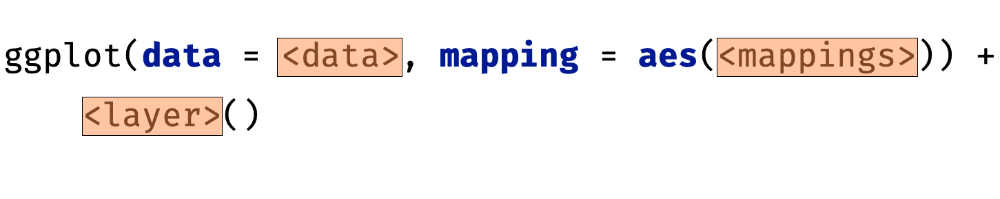
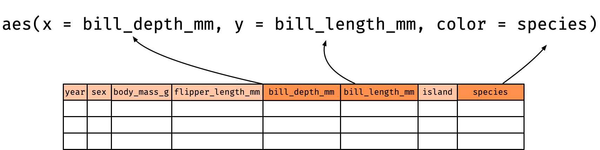
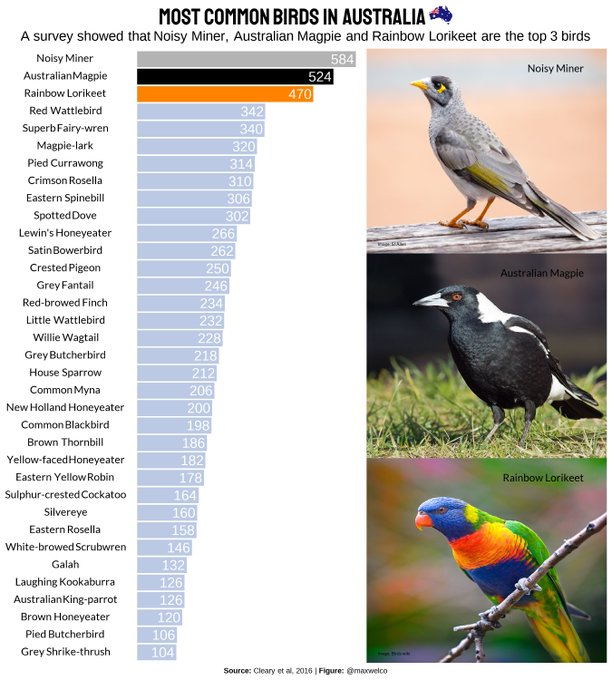

```{r, include = FALSE}
current_file <- knitr::current_input()
basename <- gsub(".Rmd$", "", current_file)

knitr::opts_chunk$set(
  fig.path = sprintf("images/%s/", basename),
  fig.width = 6,
  fig.height = 4,
  fig.align = "center",
  fig.retina = 2,
  echo = TRUE,
  warning = FALSE,
  message = FALSE,
  cache = TRUE,
  cache.path = "cache/"
)
```

```{r titleslide, child="assets/titleslide.Rmd"}
```

---

class: fullscreen

.flex.h-100[
.w-30.monash-bg-blue.center.white[

<br><br>

.circle-image-200[

]

Emi Tanaka  
  
<br>

.tl.f4.pl4[
<i class="fas fa-map-marker-alt"></i> Monash University  
<i class="fas fa-envelope"></i>  `r rmarkdown::metadata$email`  
<i class="fab fa-twitter"></i> @statsgen

]

]
.w-70.pl4[

<br><br>

* I've been using R on-and-off for over 15 years
{{content}}
]]

--

* Even as a long time R user, **_R has changed rapidly_** in the past decade
{{content}}
--

* Most of what I am talking to you about today is something I *learnt in the last 5 years*, so it's never too late to start learning R!


---


# The number of R users is growing

.panelset[
.panel[.panel-name[📊]
```{r cranlog-data, include = FALSE, cache = TRUE, eval = TRUE}
library(cranlogs)
rdat <- cran_downloads(from = "2012-10-01", to = "2021-09-01")
```
```{r cranlog-plot, echo = FALSE, fig.height = 6, fig.width = 10, eval = TRUE}
library(tidyverse)
rdat %>% 
  ggplot(aes(date, count/1e6)) +
  geom_line() +
  theme_classic(base_size = 24) +
  labs(x = NULL, y = "R Downloads (in millions)",
       caption = "Source: log downloads from RStudio CRAN mirror") +
  ylim(0, 8)
```
]
.panel[.panel-name[R]
.f5[
```{r cranlog-data, eval = FALSE}
```
```{r cranlog-plot, eval = FALSE}
```
]

]]

---

# R is one of the top programming languages

<iframe src="https://www.tiobe.com/tiobe-index/" height = "70%" width="100%"></iframe>

Note: unlike other languages, R is _not_ a general purpose language but a programming language specifically for statistics (and data science)

---

# R is _open source_

* The code within a function is visible

.f4[
```{r some-example}
x <- c(17, 20, 21, 22, 24, 21, 19, 21, 19, 21, 13, 15, 24, 16, 17, 
       21, 15, 24, 20, 17, 22, 20, 24, 14, 14, 22, 22, 16, 17, 19, 18, 
       18, 21, 17, 24, 24, 24, 16, 25, 24)
```

]

--

.f4[
```{r calc-fivenum}
fivenum(x)
```
]

--

* You can inspect the code within a function by just typing its name:

.f4.overflow-scroll.h5[
```{r fivenum}
fivenum
```
]


---

# Lastest statistical developments are often implemented in R first


--

```{r pkg-info, include = FALSE}
url <- "http://cran.rstudio.com/web/packages/packages.rds"
db <- readRDS(url(url)) %>% 
  as.data.frame()


ndb <- nrow(db)
rm(list = c("db"))
```

<br><br>

.f-subheadline.center[
There are over .monash-blue[**`r scales::comma(ndb, 100)`**] contributed R-packages ]


---

# Power of programming

.w-70[
* Learning to program is a steep learning curve!
{{content}}
]

--

* We throw our first year undergraduates into the deep end and they come out okay!
{{content}}
--

* **Investing in learning to program is worthwhile**
{{content}}
--

* Learning statistics in a point-and-click type of software, using tools that is hard to track actions (e.g. Excel), etc will _limit your growth_
{{content}}
--

* The world can rapidly change... you'll want the ability to use the latest and best statistical practice

---


class: transition 


# Grammar of graphics


.footnote.monash-bg-blue[
Wickham (2016) ggplot2: Elegant Graphics for Data Analysis. *Springer-Verlag New York*
]

---


#  Basic structure of ggplot

<center>
<br>

</center>

.info-box[
1. **data** as `data.frame` (or `tibble`), 
2. a set of **aesthetic** mappings between variables in the data and visual properties, and
3. at least one **layer** which describes how to render each observation. 
]

---

#  Palmer penguins

`penguins` data is from the `palmerpenguins` 📦

.f4[
```{r}
library(palmerpenguins)
str(penguins)
```

]


.footnote.f5[
Horst AM, Hill AP, Gorman KB (2020). palmerpenguins: Palmer Archipelago (Antarctica) penguin data. R package version 0.1.0. https://allisonhorst.github.io/palmerpenguins/ <br>
Gorman KB, Williams TD, Fraser WR (2014). Ecological sexual dimorphism and environmental variability within a community of Antarctic penguins (genus Pygoscelis). PLoS ONE 9(3):e90081.
]


---

class: font_small

# Aesthestic mappings
.center[
aesthestic = column in data
]

.f4[
```{r plot1, eval = F}
ggplot(data = penguins, 
       mapping = aes(x = bill_depth_mm, y = bill_length_mm, color = species)) + 
  geom_point()
```
]

.flex[
.w-30.center[
```{r plot1, fig.height = 4, fig.width = 4, echo = FALSE, cache = FALSE}
```
]
.w-70[

<center>

</center>

* `bill_depth_mm` is mapped to the `x` coordinate
* `bill_length_mm` is mapped to the `y` coordinate
* `species` is mapped to the `color`

]
]

---

# Bird bath survey in Australia

.flex[
.w-50.pr3[
* Clearly et al. (2016) study collected data from 2,500 citizen scientists on bathing birds all over Australia
* The data accompanying the article is available [here](https://figshare.com/articles/dataset/Avian_Assemblages_at_Bird_Baths_A_Comparison_of_Urban_and_Rural_Bird_Baths_in_Australia/3110284)
* The cleaned up version of this data is available [here](https://github.com/rfordatascience/tidytuesday/tree/master/data/2021/2021-08-31)
* The plot on the right is made by Maxwel C. Oliveira using this data
]
.w-50[
<a href="https://twitter.com/maxwelco/status/1432851097601839104"></a>
]]


.footnote.f5[
Cleary et al. (2016) Avian Assemblages at Bird Baths: A Comparison of Urban and Rural Bird Baths in Australia. https://doi.org/10.1371/journal.pone.0150899
]


---

# Wrangling data 

.panelset[
.panel[.panel-name[data]
.f4[
`bird_baths` data

```{r bird-data, echo = FALSE}
library(tidyverse)
bird_baths <- read.csv('https://raw.githubusercontent.com/rfordatascience/tidytuesday/master/data/2021/2021-08-31/bird_baths.csv')

str(bird_baths)
```

`bird_df` data
```{r bird-data-wrangle, echo = FALSE}
bird_df <- bird_baths %>%
  group_by(bird_type) %>% 
  summarise(n = sum(bird_count)) %>%
  mutate(top = fct_lump_n(bird_type, 3, w = n),
         bird_type = fct_reorder(bird_type, n)) %>% 
  filter(n > 100)

head(bird_df)
```

]
]
.panel[.panel-name[wrangling]
.f4[
```{r bird-data, eval = FALSE}
```
```{r bird-data-wrangle, eval = FALSE}
```
]
]
.panel[.panel-name[plot setup]
.f4[
```{r bird-plot-setup, cache = FALSE}
library(ggtext)
library(extrafont)
library(showtext)
showtext_auto()
font_add_google("Ranchers")
font_add_google("Raleway")
```

]
]
]


---

# Creating reproducible publication-ready plots


.flex[
.w-50[
.f5[
```{r bird-plot1, eval = FALSE}
ggplot(bird_df, aes(x = n, y = bird_type, fill = top)) +
  geom_col() 
```

]]
.w-50[

```{r bird-plot1, echo = FALSE, fig.height = 8}
```
]]

---

count: false

# Creating reproducible publication-ready plots


.flex[
.w-50[
.f5[
```{r bird-plot2, eval = FALSE}
ggplot(bird_df, aes(x = n, y = bird_type, fill = top)) +
  geom_col() +
  scale_fill_manual(values = c("gray70", "black", "#FF8300", "#006DAE"))
```

]]
.w-50[

```{r bird-plot2, echo = FALSE, fig.height = 8}
```
]]

---

count: false

# Creating reproducible publication-ready plots


.flex[
.w-50[
.f5[
```{r bird-plot3, eval = FALSE}
ggplot(bird_df, aes(x = n, y = bird_type, fill = top)) +
  geom_col() +
  scale_fill_manual(values = c("gray70", "black", "#FF8300", "#006DAE")) +
  labs(x = NULL, 
       y = NULL) 
```

]]
.w-50[

```{r bird-plot3, echo = FALSE, fig.height = 8}
```
]]


---

count: false

# Creating reproducible publication-ready plots


.flex[
.w-50[
.f5[
```{r bird-plot4, eval = FALSE}
ggplot(bird_df, aes(x = n, y = bird_type, fill = top)) +
  geom_col() +
  scale_fill_manual(values = c("gray70", "black", "#FF8300", "#006DAE")) +
  labs(x = NULL, 
       y = NULL) +
  geom_text(aes(label = n), 
            nudge_x = -40, 
            color = "white", 
            size = 5) 
```

]]
.w-50[

```{r bird-plot4, echo = FALSE, fig.height = 8}
```
]]


---

count: false

# Creating reproducible publication-ready plots


.flex[
.w-50[
.f5[
```{r bird-plot5, eval = FALSE}
ggplot(bird_df, aes(x = n, y = bird_type, fill = top)) +
  geom_col() +
  scale_fill_manual(values = c("gray70", "black", "#FF8300", "#006DAE")) +
  labs(x = NULL, 
       y = NULL) +
  geom_text(aes(label = n), 
            nudge_x = -40, 
            color = "white", 
            size = 5) + 
  theme(text = element_text(family = "Raleway"))
```

]]
.w-50[

```{r bird-plot5, echo = FALSE, fig.height = 8}
```
]]


---

count: false

# Creating reproducible publication-ready plots


.flex[
.w-50[
.f5[
```{r bird-plot6, eval = FALSE}
ggplot(bird_df, aes(x = n, y = bird_type, fill = top)) +
  geom_col() +
  scale_fill_manual(values = c("gray70", "black", "#FF8300", "#006DAE")) +
  labs(x = NULL, 
       y = NULL) +
  geom_text(aes(label = n), 
            nudge_x = -40, 
            color = "white", 
            size = 5) + 
  theme(text = element_text(family = "Raleway"),
        legend.position = "none")
```

]]
.w-50[

```{r bird-plot6, echo = FALSE, fig.height = 8}
```
]]

---

count: false

# Creating reproducible publication-ready plots


.flex[
.w-50[
.f5[
```{r bird-plot7, eval = FALSE}
ggplot(bird_df, aes(x = n, y = bird_type, fill = top)) +
  geom_col() +
  scale_fill_manual(values = c("gray70", "black", "#FF8300", "#006DAE")) +
  labs(x = NULL, 
       y = NULL) +
  geom_text(aes(label = n), 
            nudge_x = -40, 
            color = "white", 
            size = 5) + 
  theme(text = element_text(family = "Raleway"),
        legend.position = "none",
        axis.text.y = element_text(size = 12))
```

]]
.w-50[

```{r bird-plot7, echo = FALSE, fig.height = 8}
```
]]

---


count: false

# Creating reproducible publication-ready plots


.flex[
.w-50[
.f5[
```{r bird-plot8, eval = FALSE}
ggplot(bird_df, aes(x = n, y = bird_type, fill = top)) +
  geom_col() +
  scale_fill_manual(values = c("gray70", "black", "#FF8300", "#006DAE")) +
  labs(x = NULL, 
       y = NULL) +
  geom_text(aes(label = n), 
            nudge_x = -40, 
            color = "white", 
            size = 5) + 
  theme(text = element_text(family = "Raleway"),
        legend.position = "none",
        axis.text.y = element_text(size = 12),
        axis.text.x = element_blank())
```

]]
.w-50[

```{r bird-plot8, echo = FALSE, fig.height = 8}
```
]]


---


count: false

# Creating reproducible publication-ready plots


.flex[
.w-50[
.f5[
```{r bird-plot9, eval = FALSE}
ggplot(bird_df, aes(x = n, y = bird_type, fill = top)) +
  geom_col() +
  scale_fill_manual(values = c("gray70", "black", "#FF8300", "#006DAE")) +
  labs(x = NULL, 
       y = NULL) +
  geom_text(aes(label = n), 
            nudge_x = -40, 
            color = "white", 
            size = 5) + 
  theme(text = element_text(family = "Raleway"),
        legend.position = "none",
        axis.text.y = element_text(size = 12),
        axis.text.x = element_blank(),
        panel.background = element_blank())
```

]]
.w-50[

```{r bird-plot9, echo = FALSE, fig.height = 8}
```
]]


---


count: false

# Creating reproducible publication-ready plots


.flex[
.w-50[
.f5[
```{r bird-plot10, eval = FALSE}
ggplot(bird_df, aes(x = n, y = bird_type, fill = top)) +
  geom_col() +
  scale_fill_manual(values = c("gray70", "black", "#FF8300", "#006DAE")) +
  labs(x = NULL, 
       y = NULL) +
  geom_text(aes(label = n), 
            nudge_x = -40, 
            color = "white", 
            size = 5) + 
  theme(text = element_text(family = "Raleway"),
        legend.position = "none",
        axis.text.y = element_text(size = 12),
        axis.text.x = element_blank(),
        panel.background = element_blank(),
        axis.ticks.length = unit(0, "mm"))
```

]]
.w-50[

```{r bird-plot10, echo = FALSE, fig.height = 8}
```
]]


---


count: false

# Creating reproducible publication-ready plots


.flex[
.w-50[
.f5[
```{r bird-plot11, eval = FALSE}
ggplot(bird_df, aes(x = n, y = bird_type, fill = top)) +
  geom_col() +
  scale_fill_manual(values = c("gray70", "black", "#FF8300", "#006DAE")) +
  labs(x = NULL, 
       y = NULL,
       title = "Most common birds in Australia ",
       subtitle = "A survey showed that **Noisy Miner**, <b style='color:#5A5A5A'>Australian Magpie</b><br> and <b style='color:#FF8300'>Rainbow Lorikeet</b> are the top 3 birds<br>",
       caption = "**Source:** Cleary et al, 2016 | **Figure:** Inspired by @maxwelco") +
  geom_text(aes(label = n), 
            nudge_x = -40, 
            color = "white", 
            size = 5) + 
  theme(text = element_text(family = "Raleway"),
        legend.position = "none",
        axis.text.y = element_text(size = 12),
        axis.text.x = element_blank(),
        panel.background = element_blank(),
        axis.ticks.length = unit(0, "mm"))
```

]]
.w-50[

```{r bird-plot11, echo = FALSE, fig.height = 8}
```
]]


---


count: false

# Creating reproducible publication-ready plots


.flex[
.w-50[
.f5[
```{r bird-plot12, eval = FALSE}
ggplot(bird_df, aes(x = n, y = bird_type, fill = top)) +
  geom_col() +
  scale_fill_manual(values = c("gray70", "black", "#FF8300", "#006DAE")) +
  labs(x = NULL, 
       y = NULL,
       title = "Most common birds in Australia ",
       subtitle = "A survey showed that **Noisy Miner**, <b style='color:#5A5A5A'>Australian Magpie</b><br> and <b style='color:#FF8300'>Rainbow Lorikeet</b> are the top 3 birds<br>",
       caption = "**Source:** Cleary et al, 2016 | **Figure:** Inspired by @maxwelco") +
  geom_text(aes(label = n), 
            nudge_x = -40, 
            color = "white", 
            size = 5) + 
  theme(text = element_text(family = "Raleway"),
        legend.position = "none",
        axis.text.y = element_text(size = 12),
        axis.text.x = element_blank(),
        panel.background = element_blank(),
        axis.ticks.length = unit(0, "mm"),
        plot.title = element_markdown(size = 20, 
                                      family = "Ranchers", 
                                      hjust = 0.5))
```

]]
.w-50[

```{r bird-plot12, echo = FALSE, fig.height = 8}
```
]]


---


count: false

# Creating reproducible publication-ready plots


.flex[
.w-50[
.f5[
```{r bird-plot13, eval = FALSE}
ggplot(bird_df, aes(x = n, y = bird_type, fill = top)) +
  geom_col() +
  scale_fill_manual(values = c("gray70", "black", "#FF8300", "#006DAE")) +
  labs(x = NULL, 
       y = NULL,
       title = "Most common birds in Australia ",
       subtitle = "A survey showed that **Noisy Miner**, <b style='color:#5A5A5A'>Australian Magpie</b><br> and <b style='color:#FF8300'>Rainbow Lorikeet</b> are the top 3 birds<br>",
       caption = "**Source:** Cleary et al, 2016 | **Figure:** Inspired by @maxwelco") +
  geom_text(aes(label = n), 
            nudge_x = -40, 
            color = "white", 
            size = 5) + 
  theme(text = element_text(family = "Raleway"),
        legend.position = "none",
        axis.text.y = element_text(size = 12),
        axis.text.x = element_blank(),
        panel.background = element_blank(),
        axis.ticks.length = unit(0, "mm"),
        plot.title = element_markdown(size = 20, 
                                      family = "Ranchers", 
                                      hjust = 0.5),
        plot.subtitle = element_markdown(size = 12, 
                                         hjust = 0.5))
```

]]
.w-50[

```{r bird-plot13, echo = FALSE, fig.height = 8}
```
]]

---


count: false

# Creating reproducible publication-ready plots


.flex[
.w-50[
.f5[
```{r bird-plot14, eval = FALSE}
ggplot(bird_df, aes(x = n, y = bird_type, fill = top)) +
  geom_col() +
  scale_fill_manual(values = c("gray70", "black", "#FF8300", "#006DAE")) +
  labs(x = NULL, 
       y = NULL,
       title = "Most common birds in Australia ",
       subtitle = "A survey showed that **Noisy Miner**, <b style='color:#5A5A5A'>Australian Magpie</b><br> and <b style='color:#FF8300'>Rainbow Lorikeet</b> are the top 3 birds<br>",
       caption = "**Source:** Cleary et al, 2016 | **Figure:** Inspired by @maxwelco") +
  geom_text(aes(label = n), 
            nudge_x = -40, 
            color = "white", 
            size = 5) + 
  theme(text = element_text(family = "Raleway"),
        legend.position = "none",
        axis.text.y = element_text(size = 12),
        axis.text.x = element_blank(),
        panel.background = element_blank(),
        axis.ticks.length = unit(0, "mm"),
        plot.title = element_markdown(size = 20, 
                                      family = "Ranchers", 
                                      hjust = 0.5),
        plot.subtitle = element_markdown(size = 12, 
                                         hjust = 0.5),
        plot.caption = element_markdown(size = 12, hjust = 1))
```

]]
.w-50[

```{r bird-plot14, echo = FALSE, fig.height = 8}
```
]]


---


count: false

# Creating reproducible publication-ready plots


.flex[
.w-50[
.f5[
```{r bird-plotx, eval = FALSE}
ggplot(bird_df, aes(x = n, y = bird_type, fill = top)) +
  geom_col() +
  scale_fill_manual(values = c("gray70", "black", "#FF8300", "#006DAE")) +
  labs(x = NULL, 
       y = NULL,
       title = "Most common birds in Australia ",
       subtitle = "A survey showed that **Noisy Miner**, <b style='color:#5A5A5A'>Australian Magpie</b><br> and <b style='color:#FF8300'>Rainbow Lorikeet</b> are the top 3 birds<br>",
       caption = "**Source:** Cleary et al, 2016 | **Figure:** Inspired by @maxwelco") +
  geom_text(aes(label = n), 
            nudge_x = -40, 
            color = "white", 
            size = 5) + 
  theme(text = element_text(family = "Raleway"),
        legend.position = "none",
        axis.text.y = element_text(size = 12),
        axis.text.x = element_blank(),
        panel.background = element_blank(),
        axis.ticks.length = unit(0, "mm"),
        plot.title = element_markdown(size = 20, 
                                      family = "Ranchers", 
                                      hjust = 0.5),
        plot.subtitle = element_markdown(size = 12, 
                                         hjust = 0.5),
        plot.caption = element_markdown(size = 12, hjust = 1),
        plot.title.position = "plot")
```

]]
.w-50[

```{r bird-plotx, echo = FALSE, fig.height = 8}
```
]]

---

.flex[
.w-50.center[
# Before 

```{r bird-plot1, echo = FALSE, fig.height = 8}
```

]
.w-50.center[

# After

```{r bird-plotx, echo = FALSE, fig.height = 8}
```

]]


---

# Resources & Community for Learning R

* Australian Local [R-Ladies](https://rladies.org/) Chapters:
  * R-Ladies Melbourne [<i class="fab fa-meetup"></i>](https://www.meetup.com/en-AU/rladies-melbourne/) [<i class="fab fa-twitter"></i>](https://twitter.com/RLadiesMelb)
  * R-Ladies Sydney [<i class="fab fa-meetup"></i>](https://www.meetup.com/en-AU/rladies-sydney/) [<i class="fab fa-twitter"></i>](https://twitter.com/RLadiesSydney)
  * R-Ladies Canberra [<i class="fab fa-meetup"></i>](https://www.meetup.com/en-AU/rladies-canberra/) [<i class="fab fa-twitter"></i>](https://twitter.com/RLadiesCanberra)
  * R-Ladies Perth [<i class="fab fa-meetup"></i>](https://www.meetup.com/en-AU/rladies-perth/) [<i class="fab fa-twitter"></i>](https://twitter.com/RLadiesPerth)
  * R-Ladies Adelaide [<i class="fab fa-meetup"></i>](https://www.meetup.com/en-AU/rladies-adelaide/) [<i class="fab fa-twitter"></i>](https://twitter.com/RLadiesAdelaide)
  * R-Ladies Brisbane [<i class="fab fa-meetup"></i>](https://www.meetup.com/en-AU/rladies-brisbane/) [<i class="fab fa-twitter"></i>](https://twitter.com/RLadiesBrisbane)
* R for data science community [<i class="fas fa-globe"></i>](https://www.rfordatasci.com/) [<i class="fab fa-slack"></i>](https://rfordatascience.slack.com/join/shared_invite/zt-n46lijeb-2RRzQ70U34eH530~PyZsmg#/shared-invite/email)
* [Tidy Tuesday](https://github.com/rfordatascience/tidytuesday) <i class="fas fa-database"></i> <i class="fas fa-laptop"></i> 
* [Big Book of R](https://www.bigbookofr.com/) <i class="fas fa-book"></i> 


---


# Online Data Visualisation with R Workshops 


Coming in early December:

* **Data Visualisation with R** .f4[hosted by the Statistical Society of Australia NSW Branch]<br>.f5[Tentatively scheduled for full day on Mon 6th Dec]
* **Advanced Data Visualisation with R** .f4[hosted by the Statistical Society of Australia Canberra Branch]<br>.f5[Tentatively scheduled for half days on Wed-Thu 8th-9th Dec]

by Dr Emi Tanaka and Professor Dianne Cook

<br> 

## SSA Events

For full list of events, check out: <i class="fas fa-link"></i> https://www.statsoc.org.au/Events-listing


---

```{r endslide, child="assets/endslide.Rmd"}
```
